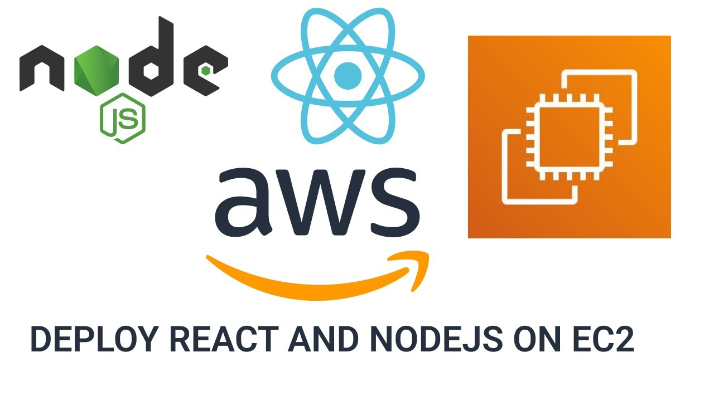

## TP 1 : Déployer une application (MERN STACK) sur une instance EC2 (AWS)


<div align="center">

</div>


## Section 1 : Déployer une application (Node.js + MongoDB) sur une instance EC2 AWS [Partie BACKEND]

Ce guide vous expliquera comment déployer la partie backend (Node.js avec MongoDB) d'un projet `MERN STACK` sur une instance `EC2` d'`AWS`.

## Étape 1 : Prérequis

1. **Création d'une instance EC2 :**

   - Lancez une nouvelle instance `EC2` sur la console `AWS`, en utilisant une image `AMI Amazon Linux 2023`.

   - Configurez les règles du groupe de sécurité pour permettre l'accès aux ports nécessaires (par exemple, port `3000` pour `Node.js`, port `27017` pour MongoDB).

2. **Connectez-vous à l'instance :**
   
   - Utilisez une `clé SSH` pour vous connecter à votre instance `EC2` :
   
     ```bash
     ssh -i votre_cle.pem ec2-user@adresse_ip_de_votre_instance
     ```

## Étape 2 : Installation de Node.js et MongoDB

1. **Node.js et npm :**
   
   - Installez `Node.js` et `npm` sur votre instance `EC2` :
   
     ```bash
     sudo yum install -y nodejs
     sudo yum install -y npm
     ```

2. **Installation de MongoDB :**
   
   - Installez `MongoDB` en suivant les instructions officielles :

     https://www.mongodb.com/docs/manual/tutorial/install-mongodb-on-amazon/#std-label-install-mdb-community-amazon-linux

## Étape 3 : Transfert du code source

1. **Transférez votre code source :**
   
   - Utilisez `SCP`, `SFTP` ou d'autres méthodes pour transférer votre code source `backend` sur l'instance `EC2` :

     ```bash
     scp -i votre_cle.pem -r chemin/local/vers/votre/code ec2-user@adresse_ip_de_votre_instance:/chemin/vers/destination
     ```

## Étape 4 : Installation des dépendances du projet

1. **Accédez au répertoire du projet :**

   - Allez dans le répertoire de votre projet `backend`.

     ```bash
     cd /MERN-STACK-EXAMPLE/backend
     ```

2. **Installation des dépendances :**
   
   - Exécutez la commande suivante pour installer les dépendances du projet :
   
     ```bash
     npm install
     ```

## Étape 5 : Configuration de MongoDB

1. **Démarrez MongoDB :**
   
   - Démarrez le service `MongoDB` sur votre instance `EC2`.

     ```bash
     sudo systemctl start mongod
     
     # Vérifier le statut du service 
     sudo systemctl status mongod
     ```

2. **Importez les données (si nécessaire) :**
   
   - Importez les données de votre base de données `MongoDB` si votre application en a besoin.

## Étape 6 : Démarrage du serveur Node.js

1. **Démarrage du serveur :**
   
   - Utilisez une commande comme celle-ci pour démarrer votre serveur `Node.js` :
   
     ```bash
     npm start
     ```

## Étape 7 : Configuration des ports (optionnel)

1. **Configuration des ports :**
   
   - Assurez-vous que les règles de sécurité de votre instance `EC2` permettent le trafic sur les ports nécessaires (par exemple, le port `3000` pour `Node.js`, port `27017` pour `MongoDB`).
   
  
  ```console
  sudo nano /etc/systemd/system/mern_backend.service
  ```
  
  ```bash
  [Unit]
  
  Description=Your Node.js Application
  Documentation=https://your-app-docs.com

  [Service]
  
  Environment=NODE_ENV=production
  ExecStart=/usr/bin/node /path/to/your/app.js
  Restart=always
  User=ec2-user
  Environment=PATH=/usr/bin:/usr/local/bin
  Environment=NODE_PATH=/usr/lib/node_modules

  [Install]
  WantedBy=multi-user.target
  ```
  
- Recharger le système des services :

  ```console
  sudo systemctl daemon-reload
  ```

- Activer le service :

  ```console
  sudo systemctl enable mern_backend.service
  ```
  
- Démarrer le service :
  
  ```console
  sudo systemctl start mern_backend.service
  ```
  
- Pour arrêter le service : 

  ```console
  sudo systemctl stop mern_backend.service
  ```


## Étape 9 : Accès à l'API Backend

1. **Accédez à votre API :**
   
   - Utilisez un outil comme `cURL` ou `Postman` pour tester l'accès à votre `API backend`.


## Étape 10 : Passez à l'étape frontend

1. **Passez à l'étape suivante :**

   [Instruction pour déployer le frontend](./FRONTEND.md)

2. **Le code se trouve dans ce répertoire :**

   [Frontend](./MERN-STACK-EXAMPLE-PROJECT/frontend/)

---

