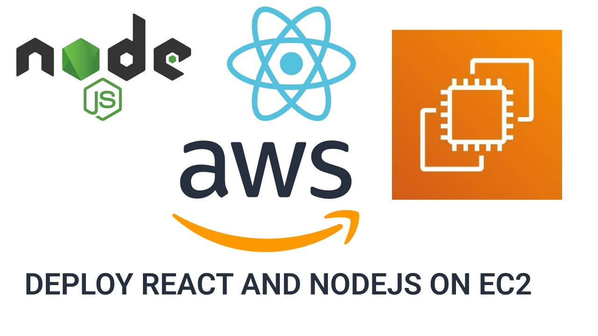

## TP 1 : Déployer une application (MERN STACK) sur une instance EC2 (AWS)


<div align="center">

</div>


## Section 2 : Déployer une application React sur une instance EC2 AWS [Partie Frontend]

Ce guide vous expliquera comment déployer la partie frontend (React) d'un projet `MERN STACK` sur une instance `EC2` d'`AWS`.

## Étape 1 : Prérequis

1. **Création d'une instance EC2 :**

   - Lancez une nouvelle instance `EC2` sur la console `AWS`, en utilisant une image `AMI Amazon Linux 2023`.

   - Configurez les règles du groupe de sécurité pour permettre l'accès `HTTP` (port 80).

2. **Connectez-vous à l'instance :**

   - Utilisez une `clé SSH` pour vous connecter à votre instance `EC2` :

     ```bash
     ssh -i votre_cle.pem ec2-user@adresse_ip_de_votre_instance
     ```

## Étape 2 : Installation des dépendances

1. **Node.js et npm :**

   - Installez Node.js et npm sur votre instance `EC2` :

     ```bash
     sudo yum install -y nodejs
     sudo yum install -y npm
     ```

## Étape 3 : Transfert du code source

1. **Transférez votre code source :**

   - Utilisez `SCP`, `SFTP` ou d'autres méthodes pour transférer votre code source `React` sur l'instance `EC2`.

## Étape 4 : Installation des dépendances du projet

1. **Accédez au répertoire du projet :**

   - Allez dans le répertoire de votre projet React.

2. **Installation des dépendances :**

   - Exécutez la commande suivante pour installer les dépendances du projet :

     ```bash
     npm install
     ```

## Étape 5 : Construction de l'application

1. **Construction du code :**

   - Exécutez la commande pour construire votre application `React` :

     ```bash
     npm run build
     ```

## Étape 7 : Démarrage du serveur (Test)

1. **Démarrage du serveur :**

   - Utilisez une commande comme celle-ci pour démarrer votre application `React` :
  
     ```bash
     npm start
     ```     

## Étape 7 : Configuration du serveur HTTP (optionnel)

1. **Installation d'un serveur HTTP :**

   - Installez `Nginx` (ou un autre serveur `HTTP`) pour servir les fichiers statiques :

     ```bash
     sudo yum install -y nginx
     ```

2. **Configuration de Nginx :**

   - Configurez `Nginx` pour pointer vers le répertoire de build de votre application `React`.

     - Ouvrez ou créez un fichier de configuration pour votre site dans le répertoire `/etc/nginx/sites-available/`.Par exemple, créez un fichier `mern_frontend` :
     
       ```bash
       sudo nano /etc/nginx/sites-available/mern_frontend
       ```

     - Ajoutez la configuration suivante en ajustant les chemins selon votre configuration :
       

       ```nginx

       server {
           listen 80;
           server_name mern_frontend.com www.mern_frontend.com;

           location / {
               root /chemin/vers/votre/application/build;
               index index.html;
               try_files $uri $uri/ /index.html;
           }

           # Autres configurations Nginx peuvent être ajoutées ici

           error_page 404 /index.html;

           location = /favicon.ico {
               log_not_found off;
               access_log off;
           }

           location = /robots.txt {
               log_not_found off;
               access_log off;
           }

           location ~ /\.(?!well-known).* {
               deny all;
           }

           # Autres configurations Nginx peuvent être ajoutées ici

           # Configurations spécifiques à votre application React peuvent être ajoutées ici
        }
       ```

       Assurez-vous de remplacer `mern_frontend.com` et `/chemin/vers/votre/application/build` par votre nom de domaine et le chemin absolu vers le répertoire `build` de votre application `React`.

     - Activer le site :
  
        Créez un lien symbolique vers le fichier de configuration que vous venez de créer dans le répertoire `sites-enabled` :   

        ```bash
        sudo ln -s /etc/nginx/sites-available/mern_frontend /etc/nginx/sites-enabled
        ```

     - Redémarrez `Nginx` :
      
        Redémarrez `Nginx` pour appliquer les modifications de configuration :

        ```bash
        sudo service nginx restart
        ```   


## Étape 8 : Configuration des ports (optionnel)

1. **Configuration des ports :**

   - Assurez-vous que les règles de sécurité de votre instance `EC2` permettent le trafic sur les ports nécessaires (par exemple, le port 80 pour `HTTP`).

## Étape 9 : Accès à l'application

1. **Accédez à votre application :**

   - Ouvrez un navigateur web et accédez à l'adresse `IP publique` de votre instance `EC2`.

---


